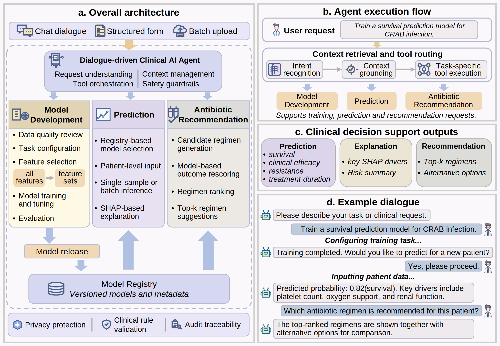
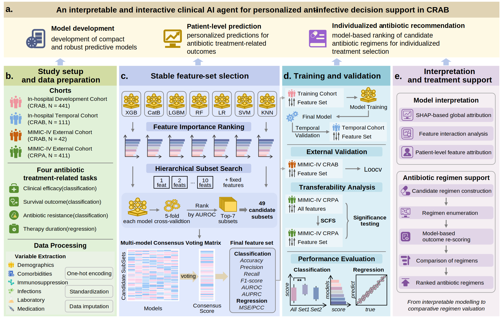

# Dr.BUG

An interpretable and interactive clinical AI agent for personalized anti-infective decision support in carbapenem-resistant Gram-negative bacterial infection

<p align="center">
  <br>
  <em>Figure 1. Framework of Dr.BUG.</em>
</p>

<p align="center">
  <br>
  <em>Figure 2. Overview of the study workflow.</em>
</p>

## Demo

A demonstration video of the Dr.BUG workflow is available on Figshare: [https://doi.org/10.6084/m9.figshare.32221362](https://doi.org/10.6084/m9.figshare.32221362).

## Experiments

The notebooks support the development and evaluation of models for CRGNB-related anti-infective decision support, with CRAB-focused primary analyses. They cover feature-set selection, model training and evaluation, temporal validation in a later same-center cohort, MIMIC-IV external validation, SHAP-based interpretation, and regimen simulation.

### Repository structure


| Directory                                      | Description                                                                                                                         |
| ---------------------------------------------- | ----------------------------------------------------------------------------------------------------------------------------------- |
| `experiments/01-Select-FeatureSet/`            | Feature-set selection notebooks for clinical efficacy, survival, polymyxin resistance, and treatment duration.                      |
| `experiments/02-Temporal-external-validation/` | Temporal validation notebooks comparing selected feature-set and full-feature models; includes a survival SHAP case-study notebook. |
| `experiments/03-MIMIC-IV-CRAB/`                | MIMIC-IV CRAB survival validation notebook.                                                                                         |
| `experiments/04-MIMIC-IV-CRPA/`                | MIMIC-IV CRPA mortality feature-set selection notebook.                                                                             |
| `experiments/05-recommendation/`               | Regimen simulation notebook using selected survival-model feature groups.                                                           |


The `experiments/` tree consists primarily of Jupyter notebooks.

### Environment

- python == 3.13.7
- numpy == 2.2.6
- pandas == 2.3.3
- scipy == 1.16.2
- scikit-learn == 1.7.2
- imbalanced-learn == 0.14.0
- xgboost == 3.1.1
- lightgbm == 4.6.0
- catboost == 1.2.8
- shap == 0.50.0
- joblib == 1.5.2
- ipykernel == 6.30.1
- jupyter_client == 8.6.3
- jupyter_core == 5.8.1

### Data

Original patient-level datasets are not distributed with this repository. The paths below indicate expected local paths for user-provided datasets when running the notebooks.


| Dataset type               | Expected local path                             | Main target column                                                          |
| -------------------------- | ----------------------------------------------- | --------------------------------------------------------------------------- |
| Primary training cohort    | `datasets/train_set.csv`                        | `Clinical_outcome`, `Survival`, `Target_Polymyxin`, `Therapy_duration_days` |
| Temporal validation cohort | `datasets/external-1.csv`                       | `Clinical_outcome`, `Survival`, `Target_Polymyxin`, `Therapy_duration_days` |
| MIMIC-IV CRAB cohort       | `datasets/MIMIC-IV-CRAB/mimicset0227.csv`       | `survival`                                                                  |
| MIMIC-IV CRPA cohort       | `datasets/MIMIC-IV-CRPA/crpa_merged_master.csv` | `mortality_28d_all_cause`                                                   |


The primary and temporal validation analyses expect clinical, microbiological, laboratory, comorbidity, infection-related, and treatment-related variables defined in the corresponding notebooks. Candidate predictors and feature groups are defined within the `feature_selection` function and can be adapted for local datasets, provided that preprocessing steps, target definitions, and downstream validation notebooks are updated consistently. The MIMIC-IV analyses use cohort-specific feature columns mapped within their notebooks. Exact column availability should be checked against the notebook preprocessing cells before execution.

### Running the notebooks

Run Jupyter from the directory that contains the notebook (or `cd` there first) so that relative paths to `datasets/` and other assets resolve as intended.

Example using `nbconvert` to execute a notebook in place:

```bash
cd experiments/01-Select-FeatureSet
jupyter nbconvert --to notebook --execute 02-survival_outcome-search-FeatureSet.ipynb --inplace
```

`--inplace` overwrites the notebook file with the executed version; use version control or a copy if you need to preserve the pre-execution notebook.

## Dr.BUG Agent

The agent is the **interactive implementation layer** for the Dr.BUG stack: it complements the `experiments/` notebooks (which document manuscript-oriented analyses) but is not a substitute for them.

The **LLM** is limited to natural-language interaction, workflow coordination, and verbalization of results. It does not train models or operate on full patient-level tables. **Model training, prediction, SHAP-based explanation, and regimen rescoring** are carried out by **deterministic backend modules**.

**Main capabilities:** data import and task configuration; model training and evaluation; feature-set selection within the training pipeline; model registry and release metadata; single-patient and batch prediction; SHAP explanation where supported; regimen library management and individualized regimen simulation; natural-language workflow guidance.

Note: Released model weights derived from real clinical data are not provided in this public repository because of clinical data governance and privacy constraints. Prediction, SHAP-based explanation, and regimen simulation require a compatible model registered in the backend model registry. Users may train and release a model locally, or upload/register their own already-trained compatible model package following the example structure.

**Layout** (for the agent implementation):


| Path                            | Description                                                                                                            |
| ------------------------------- | ---------------------------------------------------------------------------------------------------------------------- |
| `Dr.BUG-Agent/backend/`         | FastAPI service, workers, and deterministic ML and recommendation logic.                                               |
| `Dr.BUG-Agent/frontend/`        | Vue 3 + Vite + TypeScript web UI.                                                                                      |
| `Dr.BUG-Agent/models/`          | Local model registry and model-package structure used by the backend, including registry metadata and feature schemas. |
| `Dr.BUG-Agent/src/`             | Shared Python modules (pipelines, registry, prediction, SHAP helpers) imported by the backend.                         |
| `Dr.BUG-Agent/requirements.txt` | Python dependencies for the backend and `src` tree.                                                                    |


### Running

The following commands assume the shell working directory is `Dr.BUG-Agent/`.

```bash
cd Dr.BUG-Agent
```

> Backend

```bash
pip install -r requirements.txt
python -m backend.main
```

> Frontend

```bash
cd frontend
npm install
npm run dev
```

The Vite development server uses port `5173` by default.

### Privacy and governance

Store structured data and raw tables only in backend-constrained paths. When using the LLM, provide only the minimum information required for intent recognition and response phrasing. Follow all applicable privacy, governance, and clinical validation requirements.

### Intended use

This software is intended for research and development only. It may serve as an adjunct to clinical decision-making but must not be used as the sole basis for clinical decisions.

## Citation

If you use this repository, please cite the associated manuscript:

> Dr.BUG: an interpretable and interactive clinical AI agent for personalized anti-infective decision support in carbapenem-resistant Gram-negative bacterial infection.

Full citation details and BibTeX will be added when a DOI or preprint record becomes available.